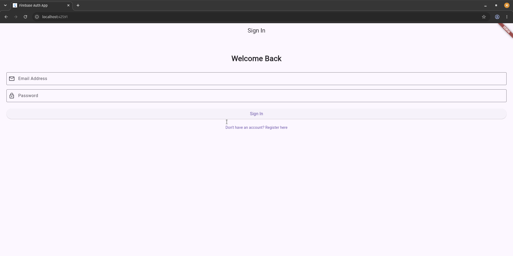
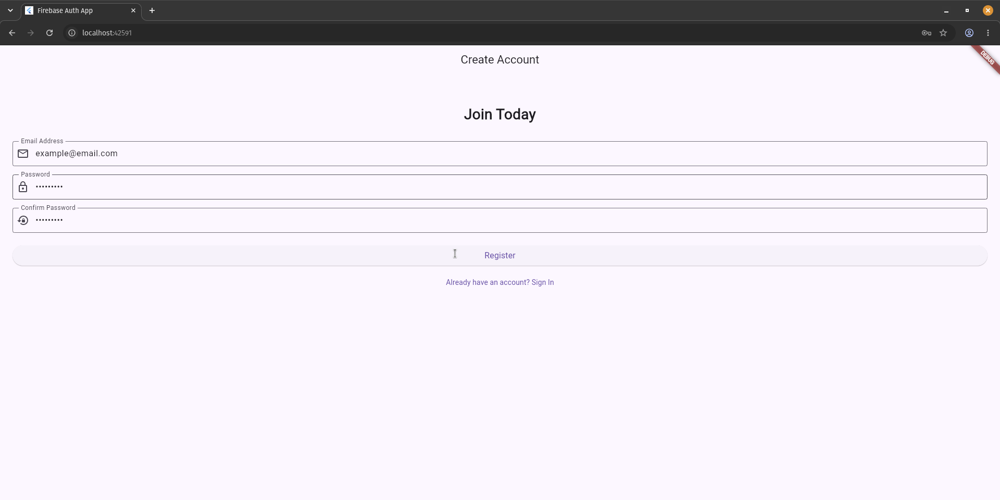
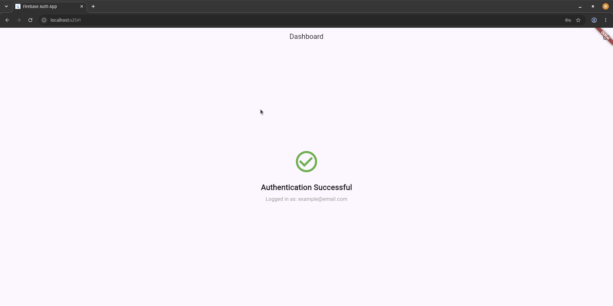

# Firebase Authentication Flow

A robust, production-ready Flutter application demonstrating a complete user authentication flow using Firebase. This project serves as my submission for the Mobile Development Elective (Track 2: Firebase Authentication).

Below is a demonstration of the complete authentication lifecycle, including registration, state-based routing, error handling, and logout.*


| Login Screen | Registration Validation | Authenticated Dashboard |
| :---: | :---: | :---: |
|  |  |  |

## Architecture & Object-Oriented Design
To ensure maintainability, this project strictly adheres to separation of concerns and object-oriented principles:
* **Encapsulated Service Layer:** All Firebase logic is isolated inside `AuthService`. The UI widgets never interact with the `FirebaseAuth` instance directly.
* **Data Abstraction:** The native Firebase `User` object is mapped to a custom `AppUser` model, preventing third-party library code from leaking into the presentation layer.
* **Reactive State Routing:** Utilizes a `StreamBuilder` at the root level to listen for authentication state changes, automatically swapping views without pushing/popping routes manually.

## Features
* **Email & Password Authentication:** Secure account creation and login.
* **Client-Side Validation:** Regex-based email formatting and password strength checks.
* **Exception Handling:** Maps Firebase exception codes to user-friendly `SnackBar` messages (e.g., "User not found", "Weak password").
* **Clean UI/UX:** Toggle seamlessly between login and registration flows.

## Learning Path
This architecture was heavily informed by proactive community resources, specifically:
* [The Dart Language Tour](https://dart.dev/guides/language/language-tour) (for understanding Streams, async/await, and OOP class structures).
* The official [Flutter YouTube Channel](https://www.youtube.com/c/flutterdev), incorporating best practices from the *Widget of the Week* and *Firebase with Flutter* series.

## Getting Started

### Prerequisites
* Flutter SDK (Latest stable)
* Dart SDK
* Firebase CLI (`flutterfire_cli` installed globally)

### Installation
1. Clone this repository:
   ```bash
   git clone https://github.com/SikhoSwart/firebase_auth

WTC-JXHZ3A5Z
